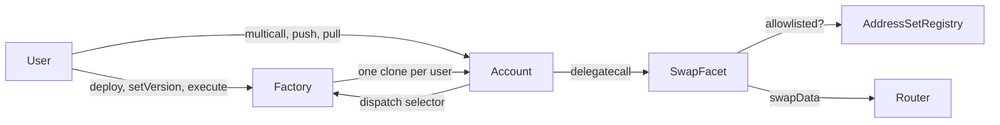
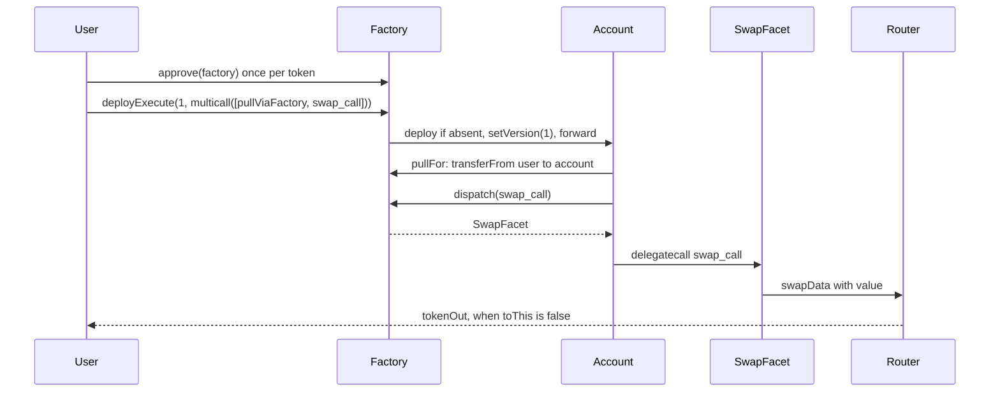

# Batcher

The Batcher is the execution layer behind OmniSwap, the swap in the Nami app. Every user gets one smart account, deployed at the same address on every supported chain, and every OmniSwap route runs inside that account. The account holds no protocol logic of its own. It forwards calls to facets registered on a factory, so what an account can do depends on which version it has adopted.

One facet is registered today, `SwapFacet`. This brief covers the three contracts that make a swap happen and the registry they lean on. Addresses for every chain are in [`deployment/batcher.json`](../../deployment/batcher.json), and the routers a swap may call are listed in [supported-swap-routers.md](./supported-swap-routers.md).

## Contracts

| Contract | Role |
|---|---|
| `BatcherAccountProxyFactory` | Deploys one account per user, holds the versioned selector to facet tables, and is the single approval target for funding an account. Same address on every chain. |
| `BatcherAccountProxy` | The per-user account. A clone of one implementation with the user's address baked into its bytecode. Moves tokens, batches calls, and forwards anything else to the facet its version names. |
| `SwapFacet` | The only facet in version 1. Calls an allowlisted router with caller supplied calldata and checks what came back. |
| `AddressSetRegistry` | Owner maintained address sets. Set 0 is the swap router allowlist. One further set per router holds the contracts that router is allowed to pull tokens through. |

The factory is deployed through CREATE3, so it lands at the same address on every chain. It deploys the account implementation in its constructor, so that address is the same everywhere too, and therefore so is every user's account address. Funds can be sent to an account that does not exist yet and picked up by the transaction that deploys it.



## The account

Each user has exactly one account. Its address is derived from the user's address, so `computeBatcherAddress(user)` predicts it before deployment and `deploy()` returns the existing one on a second call.

Every function on the account, including the fallback, accepts calls only from its user or from the factory. The factory only ever forwards on behalf of the caller who owns the account, so nobody else can act on it.

| Function | Purpose |
|---|---|
| `multicall(data)` and `multicall(data, allowRevert)` | Run several calls against the account in one transaction. Any failure reverts the whole batch unless that call is marked as allowed to fail. |
| `pullViaFactory(funding)` | Move tokens from the user into the account through the allowance the user granted to the factory. |
| `pull(token, amount)` and `permit(...)` | The same through an allowance or an EIP-2612 permit granted to the account itself. |
| `push(token, amount)` and `sweep(token, minAmount)` | Send tokens or native back to the user. `sweep` moves the full balance and reverts below `minAmount`. |
| `wrapNative(amount)` and `unwrapNative(amount)` | Convert between native and the chain's wrapped native inside the account. |
| `pullNFT`, `pullNFTViaFactory`, `pushNFT` | The same movements for ERC-721 tokens. The account can receive NFTs and native. |

Amounts accept two sentinels. `type(uint256).max` means the account's whole balance of that token. A value with the top bit set means a share of that balance, in millionths, so a later step can consume whatever an earlier step produced without the caller computing it. `address(0)` stands for native.

`multicall` runs each call as a delegatecall to the account itself. A call to one of the functions above runs directly. Any other selector reaches the fallback, which asks the factory which facet serves that selector under the account's version and delegatecalls it. The facet therefore runs as the account: `address(this)` is the account, its balances are the ones in play, and `user()` is the owner. A version that is paused reverts here, and an account that has not adopted a version reverts on every facet call.

## The factory

The factory is `Ownable2Step` and owned by the Nami deployer. Ownership cannot be renounced. It has three jobs.

**Accounts.** `deploy()` creates the caller's account. `execute(payload)` forwards one call, with value, to the caller's account. `deployExecute(versionId, data)` does deploy, adopt a version, and forward in one transaction, which is how a new user's first swap works.

**Funding.** Approving a fresh account address on every chain is a poor experience, so the user approves the factory once instead. `pullFor(funding)`, reached through the account's `pullViaFactory`, moves the calling account's own user's tokens into that same account and nowhere else. `pullNFTFor` does the same for ERC-721 operator approvals.

**Versions.** A version is an append-only table from function selector to facet address. The owner builds one in a draft, and users adopt finalized versions at their own pace.

1. `addSelectorsToVersion(groups)` adds selectors to the open draft, creating one if none is open. Each facet must answer `batcherFacetId()` with the expected marker, and a selector can appear once per version.
2. `finalizeVersion()` freezes the draft. A finalized version never changes. New facets mean a new version.
3. `setVersion(id)` binds the caller's account to a finalized, unpaused version. An account stays on its version until its user calls `setVersion` again, so an upgrade never touches existing accounts.
4. `setVersionPaused(id, paused)` stops dispatch for a version. `setVersionRescueSelector(id, selector, allowed)` keeps chosen selectors callable while paused, for exits.

A version may name an initializer that runs inside the account when the version is adopted. Version 1 has none.

`dispatch(selector)` is the read the account's fallback makes. It resolves the caller's version and returns the facet plus whether that selector is currently blocked by a pause.

## SwapFacet

`SwapFacet` is a stateless contract that every account delegatecalls. It takes one call, `swap_call`, with these parameters.

```solidity
struct SwapParams {
    address tokenIn;        // address(0) for native, sent as value
    address tokenOut;
    uint256 amountIn;       // exact, whole balance, or a share of it
    address swapRouter;     // must be on the allowlist
    address approveTarget;  // zero means the router itself
    bool    toThis;         // output stays in the account, or goes to the user
    uint256 minAmountOut;   // zero skips the output check
    uint256 value;          // native forwarded with the call
    bytes   swapData;       // the router calldata from the aggregator's API
}
```

The facet does not parse `swapData`. The allowlist and the output check are the guards, so the call is deliberately strict.

1. `swapRouter` must be in the registry's set 0, else `NotRouter`.
2. The spender defaults to the router. A different `approveTarget` must be registered in that router's own set, else `NotApproveTarget`. This exists for aggregators that approve one contract and call another, such as OKX and Bebop JAM.
3. If `value` is non-zero the account must hold it, else `InsufficientValue`.
4. For an ERC-20 input the facet resolves `amountIn` and approves the spender for that amount plus one, which keeps the allowance slot warm for the next swap.
5. The router is called with `swapData` and `value`. A revert surfaces as `FailedSwap`.
6. If `minAmountOut` is non-zero the recipient's `tokenOut` balance must have grown by at least that much, else `MinAmountViolated`.

`toThis` decides where the output lands. Sending it to the account lets a later call in the same batch use it. The receiver encoded in `swapData` should agree with that choice.

The selector of `swap_call` is derived from the full parameter tuple. Any change to `SwapParams` gives a new selector, which ships as a new version carrying both the old and the new selector, each pointing at its own facet. Clients encoding the old shape keep working after an account re-binds.

## A swap, end to end



A returning user skips the factory and calls `multicall` on the account directly. `pullViaFactory` with the exact input amount, then `swap_call` with `amountIn` set to the whole-balance sentinel and `toThis` false, is the common shape. Native input needs no pull. The value rides on the transaction and `swap_call` forwards it.

## What is live

Version 1 is finalized on 14 chains. It registers exactly one selector, `swap_call`, pointing at that chain's `SwapFacet`. It has no initializer and is not paused. In [`deployment/batcher.json`](../../deployment/batcher.json), `latestFinalizedVersion` is the version a new client should pass to `deployExecute` or `setVersion`, and `versions` lists each version's facets with the functions they serve.

## Trust notes

- A facet runs as the account. Adopting a version means trusting that version's code with whatever the account holds and whatever the user has approved to the factory. Finalized versions cannot change, so what a user adopts is what runs.
- The only guard on router calldata is the allowlist, so set `minAmountOut` whenever the account can see the output. A zero value skips the check, which is what a cross-chain route needs, since the output never lands on this chain for the facet to measure. It also covers routers that enforce the slippage bound themselves, where the check would be redundant. Passing zero for an ordinary local swap leaves it unprotected.
- The account only answers its user and the factory, and the factory only forwards for the caller who owns the account.
- The Batcher was audited by BailSec. The report is in [`audits/`](../../audits/).

## Related

- [supported-swap-routers.md](./supported-swap-routers.md), the router allowlist per chain with approve targets
- [`deployment/batcher.json`](../../deployment/batcher.json), contract addresses and versions per chain
