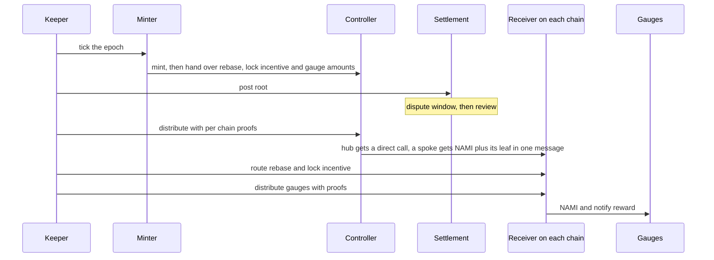

# Emissions

Every week the hub mints new NAMI and the protocol sends it where the votes said. The pipeline has four stages. The Minter creates the week's NAMI, a settlement root says how much each chain and each gauge gets, the controller ships each chain its slice, and a receiver on every chain pays it out. Minting, settlement and dispatch are hub only. Receiving is everywhere.

## Contracts

| Contract | Where | Role |
|---|---|---|
| `Minter` | Hub | Computes the weekly emission, splits it into three categories and mints the shortfall. |
| `EmissionsController` | Hub | Holds the week's NAMI and dispatches each chain's slice once a root is active. |
| `EmissionsSettlement` | Hub | The root of the week. Posted by a keeper, held for a dispute window, then consumed exactly once. |
| `EmissionsReceiver` | Every chain | Takes delivery, routes the rebase and lock incentive, and streams gauge emissions against proofs. |

## The weekly mint

The Minter runs once per epoch, on a permissionless call that does nothing until the week has flipped. Each week's emission is the previous week's scaled by a decay factor. The owner sets the first week's amount before epochs start and can retune the factor anywhere from 5% to 200%, so emissions can be made to shrink or grow.

The week is split into three categories. The rebase rate is owner tunable defaults, and gauges always take the remainder.

| Category | Default | Goes to |
|---|---|---|
| Rebase | 4% | Permanent-lock holders, through the rewards distributor |
| Lock incentive | 10% | The bonus budget that pays users for locking their claims |
| Gauge | Remainder | Pools, in proportion to the votes they received |

The genesis epoch pays no rebase.

## Settlement

The Voter records weights on every chain, but no contract re-aggregates them across chains. A keeper reads the epoch's votes, computes per-chain totals for each category and a per-gauge allocation for each chain, and commits it all as one Merkle root. Each chain's leaf carries the three category amounts and that chain's own gauge root.

A keeper-posted root is not usable at once. It cannot activate until its dispute window has elapsed, and that window is never shorter than 1 hour or longer than 4 hours, so at least 1 hour always passes between posting a root and spending it. During the window any disputer can challenge the root and block activation. Once the window has elapsed, disputer reviews activate it. The review threshold is one by default, and a root manager can raise it to an M-of-N quorum. A root manager can also approve instantly or replace a root, which is a trusted admin path. Once the controller starts distributing against a root, the root is consumed and cannot change.

## Distribution

With an active root the keeper calls the controller with every chain's leaf and proof. The controller checks each leaf against the root, refuses to exceed what the Minter funded per category, and delivers. The hub's own receiver gets a direct call. A spoke gets its NAMI and its settlement leaf in one bridge message on the system lane, so the tokens and the instructions arrive together or not at all. Chains already served are skipped, so calling again is safe. A spoke counts as served once its message is sent, so a delivery that fails on the spoke is retried at the bridge rather than by dispatching again.

On each chain the receiver then does three things, each driven by a keeper.

1. Route the rebase category to the rewards distributor and the lock incentive category to the claimer.
2. Stream the gauge category to local gauges in keeper-sized batches, each allocation proven against the chain's gauge root. An allocation for a frozen or inactive pool is rejected, so the keeper leaves it out and its NAMI lands in the residue.
3. Finalize the epoch, sweep any residue and advance the settlement frontier that pool changes are gated on.

The receiver also runs two standing programs over a configured gauge set that do not depend on votes: a fixed weekly NAMI reward and a bonus reward paid in a second token set at deployment.

## Trust notes

- The model is optimistic. Correctness rests on disputers watching every root during the window, and on the review threshold being raised above its default of one and staffed with real reviewers. A disputer cannot be removed if that would drop the count below the threshold.
- The immediate manager path skips the window. It exists for recovery and is a trusted action.
- The controller can never dispatch more of a category than was minted for it. An owner escape hatch can close a stuck epoch and sweep the residue.
- Keeper actions are safe to repeat.

## Related

- [voter](../voter/README.md), the weights the keeper compiles
- [rewards](../rewards/README.md), where the rebase and lock incentive land
- [gauges](../gauges/README.md), what a gauge does with its NAMI
- [omnichain](../omnichain/README.md), the system lane that carries NAMI and leaves to spokes
