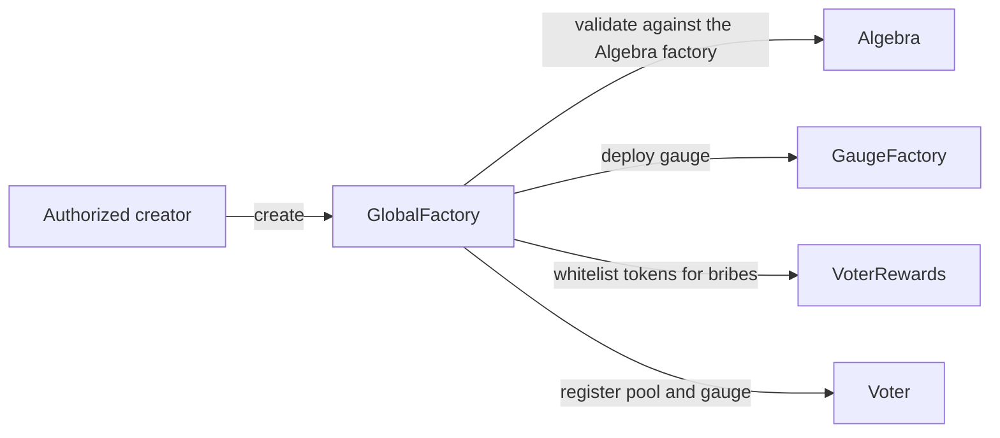
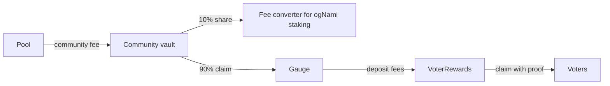

# Pools and gauges

A gauge is the contract that turns votes into rewards for one pool. Every pool Nami emits to is an Algebra Integral concentrated-liquidity pool, and every gauge is created by a factory on the chain the pool lives on. This brief covers the pools, the two factories and the gauge, and how fees and emissions flow through them.

## Pools

Nami does not fork an AMM. Pools are Algebra Integral v1.2.2 pools, with the swap math, positions, ticks and fees owned by Algebra. What Nami adds is a plugin attached to every pool. The plugin supplies a volatility oracle, a dynamic fee that follows volatility, the hook that keeps the farming contract informed, MEV protection, and an optional launch guard called AntiSniper. AntiSniper charges a swap surcharge that decays to zero over a pool's opening window, can hold swaps until a start time, and freezes its own configuration once the window opens. It is active only on launch pools.

Each pool has a community vault that receives the pool's community fee. That vault is the gauge's fee source.

## Contracts

| Contract | Role |
|---|---|
| `GlobalFactory` | The entry point for bringing a pool into emissions. Validates the pool, creates the gauge, whitelists the pool's tokens for bribes and registers the pool with the Voter. |
| `GaugeFactory` | Deploys each gauge as a beacon proxy at a deterministic address and keeps the registry. One beacon upgrade reaches every gauge. |
| `GaugeEternalFarming` | The gauge. Holds no liquidity. Passes emissions into Algebra farming and forwards fees to voters. |

Gauge creation is permissioned. The caller must be an authorized creator, both pool tokens must be whitelisted, and the pool must be the exact pool the Algebra factory reports for that token pair, so an arbitrary contract cannot be registered.

## Emissions in

The gauge accepts NAMI only from the emissions receiver, and it does not distribute it to stakers itself. It hands the NAMI to the incentive maker, which raises the per-second reward rate on the pool's eternal farming incentive for the coming week. Liquidity providers earn from Algebra farming directly, in range, without staking anything in the gauge. See [rewards](../rewards/README.md).

## Fees out

A pool only charges its full community fee once it has a gauge. The community fee setter, driven by the Voter, raises the fee when a pool is registered and restores the default while the pool is frozen. From the vault 10% goes to the fee converter that funds ogNami staking, and the gauge claims the remaining 90% into `VoterRewards`, credited to the pool for the current epoch, where voters claim it. Fee claims run through the gauge factory under a claimer role, and the keeper claims before each weekly flip so fees count toward the closing epoch.

## Trust notes

- Pool and gauge are bound once. A pool never changes gauge and is never removed. Freezing is the only way to take it out of emissions.
- Gauges share a beacon. An upgrade to the beacon changes every gauge at once, so beacon ownership is one of the sensitive admin keys.

## Related

- [voter](../voter/README.md), where pools receive votes
- [emissions](../emissions/README.md), how a gauge's weekly NAMI is settled
- [rewards](../rewards/README.md), the incentive maker and voter rewards
- [omnichain](../omnichain/README.md), how a new pool becomes visible on other chains
