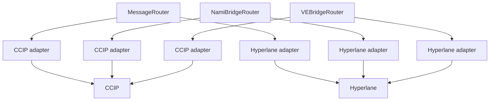

# Omnichain

Nami runs the same protocol on several chains and treats them as one. A hub chain, Ethereum, holds the canonical state: the NAMI mint, the Minter, emissions settlement and dispatch, the spoke registry and ogNami staking. Spoke chains host pools and receive bridged emissions. Every chain, hub included, runs the full local stack: vote escrow, the Voter, the emissions receiver, the pool handler, the gauge factories, the rewards contracts and the messaging routers. A user on any chain locks, votes, provides liquidity and claims locally.

This brief covers the two things that hold the chains together: a shared view of pool state, and the messaging layer that moves tokens, positions and instructions between chains.

## Contracts

| Contract | Where | Role |
|---|---|---|
| `SpokeRegistry` | Hub | The list of spoke chains, checkpointed per epoch so settlement can ask which spokes existed in a past epoch. |
| `CrossChainPoolHandler` | Every chain | Registers local pools with the Voter and broadcasts their state to peers. |
| `MessageRouter` | Every chain | Carries protocol messages with no token attached, on admin-configured lanes. |
| `NamiBridgeRouter` | Every chain | Burns NAMI here and mints it there, on the user lane or the system lane. |
| `VEBridgeRouter` | Every chain | Carries iNFTs and wveNami between escrows. |
| `CCIPBridgeAdapter`, `HyperlaneBridgeAdapter` | Every chain | One adapter per router and provider. Translates a router's payload into a CCIP or Hyperlane message and back. CCIP carries the traffic, with Hyperlane kept as a backup for future expansion. |

## Pool state across chains

Each pool is an independent gauge on its own chain. What the chains share is a view of which pools exist and whether each one is frozen or in cooldown, so that a voter on one chain can vote for a pool on another and settlement everywhere agrees on the active set.

- A pool's state is owned by the chain it lives on. Only that chain can register, freeze or flag it.
- Changes reach other chains by an explicit broadcast, sent per peer chain by the owner or a broadcaster role. A chain may only assert state for its own pools.
- Every relay carries a revision number. A receiver applies newer state and ignores anything it already has, so replays and out-of-order delivery are harmless.
- Pools are never removed. Around every epoch flip, three hours on each side, no local pool can be added, frozen or flagged and no spoke can join or leave, so the settlement for the closing epoch sees a fixed universe. Relays of changes made before the window can still land inside it.

## Messaging

Every cross-chain action goes through a router that owns the protocol meaning of the message and an adapter that owns the transport. The router, or for NAMI the token it calls, decides what is burned, minted, decoded and rate limited. The adapter only carries bytes. Two providers are supported, Chainlink CCIP and Hyperlane. NAMI and position sends choose the provider per call. Message lanes use the provider fixed on the admin-configured route. A provider can be rotated, or a second adapter registered, without touching protocol logic.

> **CCIP is the transport in use.** Every lane runs on it today. Hyperlane is built and wired as an equal second adapter, held as a backup and for future expansion, ready for governance to register when it is needed.

An adapter is bound to exactly one router at deployment and refuses anything else. On the way in, a message passes the provider's own authentication, then the adapter's peer check, then the router's adapter registry, then the router's payload rules, before anything is minted or executed.

**NAMI** moves on two lanes with separate rate limits, described in [token](../token/README.md). The system lane is reserved for allowlisted protocol callers, can only mint to allowlisted receivers, and can carry a message with the tokens. That is how a spoke receives its weekly NAMI and its settlement leaf in one atomic delivery.

**Positions** move through the VE bridge router, which holds its own rate limits denominated in locked NAMI, refilling over a day and shared by iNFT and wveNami traffic.

**Messages** with no value, such as pool state broadcasts, go through the message router on lanes the admin configures per sender and destination, with an allowlist of receivers on the destination.

## Trust notes

- Delivery and replay protection belong to the provider. Nami's checks decide who may deliver, not that a message arrives exactly once. Once a second adapter is registered, a route can be moved off a provider that is down.
- Outbound sending can be paused, and unpause is reserved to the owner. The routers never block inbound delivery. An adapter pause holds both directions, and the provider retries inbound messages until it is lifted. Removing an adapter from a router strands messages in flight, so a rotation drains the lane first.
- Every mint on the bridge path is bounded by a rate limit, and the limits are held by a dedicated role.

## Related

- [token](../token/README.md), NAMI's two bridge lanes
- [ve](../ve/README.md), which positions bridge and when
- [voter](../voter/README.md), the pool state that is broadcast
- [emissions](../emissions/README.md), the system-lane delivery of NAMI plus settlement
