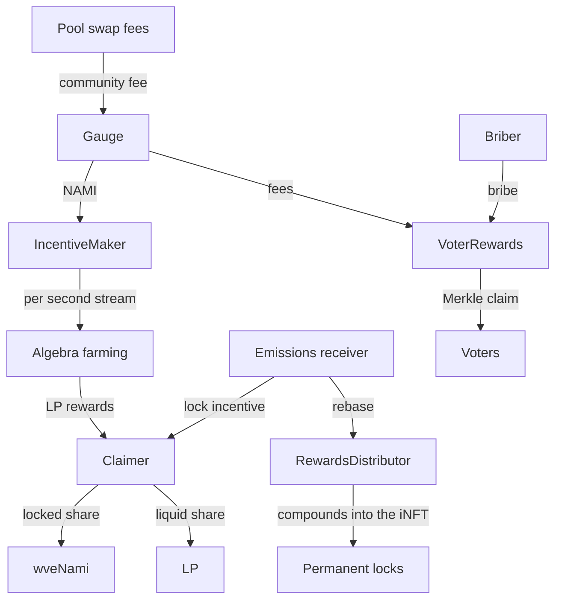

# Rewards

Rewards are collected on the chain where they arise and paid out on that same chain. Five contracts sit between the emissions pipeline, the pools and the user, and all five are deployed on every chain. Fees and bribes are allocated off chain and claimed against a per-epoch Merkle root that runs through the same post, dispute and activate lifecycle as emissions. The rebase and the auto-lock split are computed on chain.

## Contracts

| Contract | Role |
|---|---|
| `VoterRewards` | Collects trading fees and bribes per pool and epoch, and pays voters against a Merkle root. |
| `RewardsDistributor` | The rebase. Takes the week's rebase category and lets permanent locks claim their share. |
| `Claimer` | The user's claim aggregator. Collects gauge and farming rewards and applies the partial auto-lock if applicable. |
| `IncentiveMaker` | Turns gauge emissions into per-second farming incentives on the pool's Algebra farm. |
| `AlgebraCommunityFeeSetter` | Switches a pool's community fee on once the pool has a gauge, so fees flow to the gauge, and back to the default while the pool is frozen. |

## Fees and bribes for voters

A gauge forwards its pool's trading fees into `VoterRewards`, credited to the pool for the epoch in which they arrive. Anyone can add a bribe to a pool for the current epoch or up to four epochs ahead, provided bribes are enabled for that pool, the token is whitelisted globally or for that pool, the pool is not frozen and the contract is not paused. A bribe for the current epoch cannot be added in the blackout hour. A pool's own two tokens are whitelisted when its gauge is created.

Fees and bribes are pooled in one ledger per epoch, pool and token. After the epoch closes a keeper computes each voter's share from the recorded votes and posts a root. Once the root is active, a voter claims with a proof, or lets an approved claimer, a relayer or their Batcher account claim for them. Each claim slot can be used once.

## Rebase

The rebase is the d(3,3) anti-dilution payment. Each week a keeper routes the rebase category through the emissions receiver into `RewardsDistributor`. Each lock's share is its voting power over total voting power at the end of the epoch, and only permanent locks can claim theirs. A normal lock accrues a pending balance for information only and cannot claim it until it converts to an iNFT, at which point the whole history becomes claimable. A claim is deposited back into the same lock rather than paid out. The one exception is a lock that has been bridged away, whose remaining rebase stays claimable by its last owner.

## Claiming and auto-lock

`Claimer` is the single place a liquidity provider claims from. It gathers gauge rewards, Algebra farming rewards and the rebase, and it can be driven through a Batcher account, with entitlements resolved to the real user.

NAMI that gauges or the farming contract push into the Claimer is split. A floor of 20% is locked into wveNami, a permanent position, and the rest is paid liquid. A user can choose to lock more, up to everything. Locking above the floor earns a bonus of up to 10% of the claim, paid from the lock incentive category the Minter set aside, scaled by how far above the floor the user goes, and locked alongside the floor share. When the bonus budget runs low, the lock share falls back toward the floor rather than failing.

## Farming incentives

Concentrated-liquidity gauges do not hold positions. When a gauge receives its weekly NAMI it hands it to `IncentiveMaker`, which tops up the pool's eternal farming incentive and sets a per-second rate that drains the whole remaining reserve over one week. In-range liquidity earns continuously, and a fresh top-up each week keeps the stream alive.

## Trust notes

- Voter claims depend on roots a keeper posts. A keeper-posted root waits out its dispute window before anyone can claim against it, never less than 1 hour, so disputers always have time to challenge it first. A root manager can post or approve a root immediately, which is a trusted action.
- Bribe managers can withdraw an unallocated bribe, but only before the epoch closes, outside the cooldown window and before a root is posted.
- The rebase balance owed to lockers cannot be swept by the owner's rescue function.
- Pausing `VoterRewards` stops voter claims and bribe deposits. Unpause is reserved to the admin. The admin recovery claim still runs while paused and still needs a valid proof.

## Related

- [emissions](../emissions/README.md), the categories that fund the rebase and the lock bonus
- [gauges](../gauges/README.md), the gauges that deposit fees and emissions
- [ve](../ve/README.md), the locks that receive the rebase
- [token](../token/README.md), the wveNami the auto-lock mints
