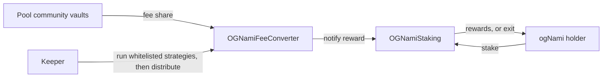

# Staking

ogNami holders stake it to earn a share of the protocol's trading fees. Staking is Base only, like the token. A staker receives a receipt token one to one for the ogNami deposited, and rewards stream to receipt holders continuously, one week at a time, paid as USDC.

## Contracts

| Contract | Role |
|---|---|
| `OGNamiStaking` | The staking contract and the receipt token, an ordinary ERC-20. Stake, unstake, claim, or exit with both in one call. |
| `MultiRewardsDistributor` | The reward engine inside it. Up to 20 reward tokens, each streamed at a fixed rate over a week. |
| `OGNamiFeeConverter` | Receives the fee share, converts it through keeper-run strategies and tops up the staking rewards each epoch. |
| `WrappedRewardTokenAdapter` | Wraps a reward token with fewer than 18 decimals, such as a 6-decimal stablecoin, into an 18-decimal unit. Without it the per-share reward math would truncate small amounts away. Payouts round back down to the underlying unit. Created on demand per token. |

## How it works

- **Stake** any amount, or zero for the full balance, and the receipt is minted. **Unstake** burns it and returns ogNami. The receipt transfers freely, and every balance change, transfers included, checkpoints the rewards of both sides first, so accrual follows the balance.
- **Rewards** follow the Synthetix model. A deposit of a token sets a rate that pays it out over one week to receipt holders in proportion to their balance. A further deposit before the week ends folds the unpaid remainder into a new rate. The contract refuses a rate its balance cannot cover.
- **Claims** pay all tokens or one, to the staker, to a receiver named in the call, or to a redirect address the staker sets. A Batcher account can claim for its user once the batcher factory is configured on the staking contract.
- **Funding** comes from the fee converter, once the owner has whitelisted it as a distributor. A configured share of each pool's community fee is routed to the converter. That share is set on the Algebra vault side, not in the Nami contracts. A keeper runs whitelisted strategies inside the converter to claim and convert those fees, then distributes the balances to staking. Only registered reward tokens can be distributed.

## Trust notes

- The owner registers and removes reward tokens, whitelists distributors and strategies, and can claim any account's pending rewards to any address or set a redirect on its behalf. A reward token can only be removed a week after its stream ends.
- The staking contract's token recovery cannot touch staked ogNami or any active reward token. The converter's withdraw has no such limit and can move any balance it holds.
- Ownership of the staking contract, the converter and the adapter factory cannot be renounced.

## Related

- [token](../token/README.md), what ogNami is
- [gauges](../gauges/README.md), where the fee share is taken from the community vault
- [rewards](../rewards/README.md), the other fee stream, to voters
