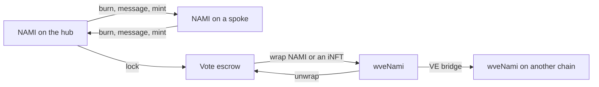

# Token

Nami runs on three fungible tokens. NAMI is the emissions token the rest of the protocol is built around. wveNami is a liquid, fungible claim on a permanent lock. ogNami is the fixed-supply presale token, and its holders earn 10% of trading fees. This brief covers what each one is and how it moves between chains.

## Contracts

| Contract | Where | Role |
|---|---|---|
| `NamiHub` | Hub | The canonical NAMI. The only place NAMI is created: a one-time genesis mint and the weekly emissions, both triggered by the Minter. |
| `NamiSpoke` | Every spoke | The bridged NAMI. Its supply exists only because the same amount was burned on another chain. |
| `wveNami` | Every chain | An ERC-20 that represents a 1:1 share of a single pooled permanent lock held inside vote escrow. |
| `OGNami` | Hub | A plain ERC-20 with a fixed maximum supply, minted once. It can be burned and never bridged. |

## NAMI

NAMI is one logical token across every chain, and only the hub creates it. The genesis supply of 1,200,000 NAMI is minted once through the Minter, which forwards it to the configured genesis recipient. After that the only new NAMI is the weekly emission, which the Minter alone can trigger. See [emissions](../emissions/README.md).

Bridging follows the xERC20 shape. NAMI is burned on the source chain, a message crosses, and the same amount is minted on the destination. Total supply across chains is unchanged by bridging. Every mint and burn on the bridge path passes through a rate limit, and there are two independent lanes.

| Lane | Who uses it | Limit |
|---|---|---|
| User | Anyone bridging their own NAMI | A token bucket per chain that refills continuously over a day. A large transfer drains headroom, which returns gradually. |
| System | Protocol flows such as emissions, from allowlisted callers to allowlisted receivers | A fixed cap per seven-day period, counted from when the caps were last set. It stays drained until that period rolls over, then refills in full. |

Protocol traffic never competes with user bridging, and a problem on one lane cannot spend the other. The limits are set by a dedicated role that holds no other authority over the token. Holders can always burn their own balance outside the limits. The routers and adapters that carry the message are described in [omnichain](../omnichain/README.md).

## wveNami

Locking NAMI as a permanent lock, an iNFT, gives constant voting power but a position that cannot be unlocked. wveNami makes that liquid. The contract holds one large permanent lock inside vote escrow, and each wveNami is a 1:1 share of it.

- Wrap NAMI, or an iNFT you own, and the contract grows its pooled lock and mints the same amount of wveNami.
- Unwrap and the contract carves a fresh iNFT of that size out of the pool for you, or merges the amount into an iNFT you own.
- The pooled lock never votes.

wveNami is deployed on every chain and bridges over the VE bridge rather than the NAMI bridge. Bridging burns wveNami and shrinks the pooled lock on the source chain, then grows the pooled lock and mints wveNami on the destination. Bridging pauses in the hour before and after the weekly epoch flip for everyone but whitelisted bridgers.

The rewards module locks a share of every gauge claim into wveNami. See [rewards](../rewards/README.md).

## ogNami

ogNami has a fixed maximum supply of 250,000 tokens, minted in full at deployment on the hub. There is no mint function, no bridge surface and no access control. Supply can only fall through burns. Holders stake it for a share of protocol trading fees. See [staking](../staking/README.md).

## Trust notes

- All new NAMI comes from the Minter on the hub. The token's admin role can reassign the minter and grant the bridge operator role, so that role is the key to supply.
- Bridge limits are the safety valve. A bridge fault is bounded by the lane's headroom, not by the supply.
- wveNami has an owner-managed blocklist of addresses that cannot receive it, kept to disable secondary markets if needed. Ownership cannot be renounced.

## Related

- [ve](../ve/README.md), the locks that wveNami wraps
- [omnichain](../omnichain/README.md), the routers and rate limits behind bridging
- [emissions](../emissions/README.md), where weekly NAMI comes from
- [staking](../staking/README.md), what ogNami is for
