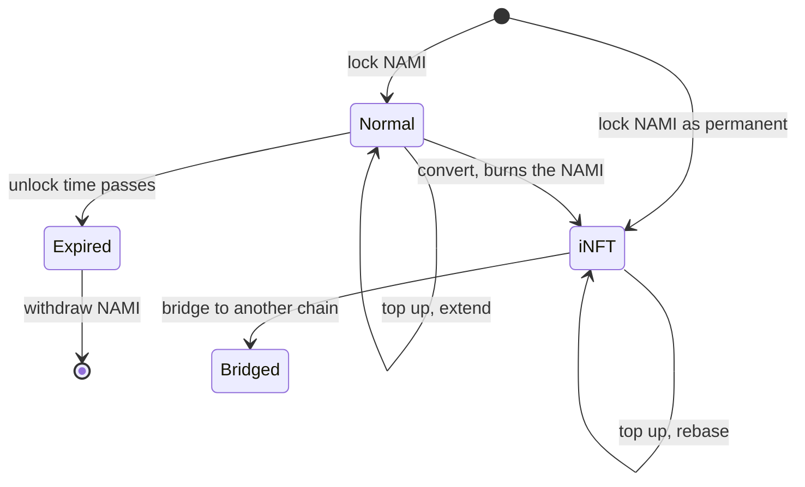

# Vote escrow

Vote escrow is where NAMI becomes voting power. A holder locks NAMI and receives a veNFT, an ERC-721 position that votes in the [Voter](../voter/README.md) and earns the fees, incentives and rebase that follow. The escrow is deployed on every chain, so a position can be created and used on whichever chain its owner prefers.

The escrow is an EIP-2535 diamond. One proxy address is the NFT contract, and the logic lives in facets behind it. Facet changes go through a two-step proxy admin role that is distinct from the owner who sets application parameters, and that role is held by a timelock.

## Two kinds of lock

| | Normal lock | iNFT, the permanent lock |
|---|---|---|
| Duration | Up to 26 weeks, unlock time rounded down to an epoch boundary | Forever |
| Voting power | Proportional to time left, so a 26 week lock starts near the locked amount. Decays linearly to zero at unlock | Constant, equal to the locked amount |
| The NAMI | Held by the escrow and returned on withdrawal | Burned on lock, never returned |
| Rebase | Accrues, but cannot be claimed until converted | Yes, the only position that can claim |
| Bridging | No | Yes |
| Exit | Withdraw after unlock | None. Merge, split or wrap into wveNami |

A normal lock can be converted into an iNFT while it is unexpired, and the conversion is one way. Both kinds accept top-ups, and a normal lock can extend its unlock time within the cap. The system's total voting power is the decayed sum of normal locks plus the constant sum of iNFTs, checkpointed on every change so any past value can be read.

## Working with positions

- **Merge** folds one position into another of the same kind. A normal lock takes the later unlock time.
- **Split** divides a position into two, or peels an amount off into a new position for someone else. **Partial merge** moves an amount between two positions directly. These need the caller to be whitelisted. A wildcard entry opens the plain split to everyone, while split-off and partial merge always need an individual entry.
- **Transfers** are ordinary ERC-721 transfers, blocked while the position has an active vote. Voting power reads as zero in the block a position changes hands, which removes flash-vote tricks.
- **Rebase** is deposited straight into the iNFT it belongs to. See [rewards](../rewards/README.md).

## Bridging an iNFT

Only iNFTs bridge, since a normal lock decays against its own chain's clock. The escrow burns the position on the source chain and sends a message through the VE bridge router. The destination escrow mints a fresh iNFT of the same size to the recipient. The position must have no active vote and no unclaimed rebase. Bridging pauses in the hour before and after the epoch flip for everyone but whitelisted bridgers. The router applies its own rate limits, described in [omnichain](../omnichain/README.md).

## Trust notes

- The owner can pause bridging and manage the split whitelist. It cannot transfer positions or touch normal locks.
- Facet upgrades sit behind a two-step proxy admin role distinct from the owner, held by a timelock.
- The escrow exposes an EIP-5805 delegation interface, but delegation is disabled. The only accepted delegatee is a sink address.

## Related

- [token](../token/README.md), NAMI and the wveNami wrapper over a pooled iNFT
- [voter](../voter/README.md), where a position's power is spent
- [rewards](../rewards/README.md), the rebase that compounds into iNFTs
- [omnichain](../omnichain/README.md), the VE bridge router and its limits
