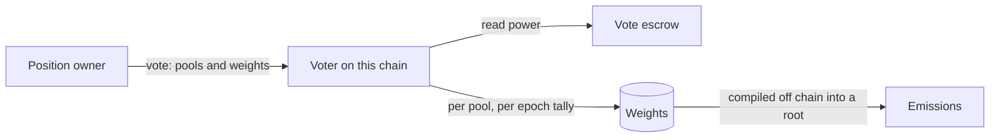

# Voter

The Voter is where veNFT holders decide where emissions go. Each week a position's owner splits its voting power across pools, and the recorded per-pool weights are the input the emissions pipeline settles against. A Voter runs on every chain. A position votes on the chain it lives on, and its allocations can name pools on any chain, which is what makes voting omnichain.

Like the escrow, the Voter is an EIP-2535 diamond: one proxy, a set of facets, and a timelocked proxy admin role, distinct from the owner, for upgrades.

## Voting

A vote is a list of pools, each with a relative weight. The Voter reads the position's current voting power from the escrow and spreads it across the list in proportion to the weights. The result is added to each pool's tally for the current epoch.

- Re-voting in the same epoch replaces the earlier vote in full.
- **Poke** re-applies the previous epoch's list against the position's current power, so a standing allocation carries forward as long as the position voted or poked the week before.
- **Reset** clears the vote. It works even while the Voter is paused, so a holder can withdraw a vote at any time outside the blackout hour.
- A vote may name up to 50 pools by default. Positions below a minimum voting power, one NAMI by default, cannot vote unless whitelisted.

Read-only views let a client validate a vote before sending it and get a clear reason back for any allocation that would fail.

## The epoch tail

An epoch is one week, flipping on Thursday at 00:00 UTC. The last hours of each epoch carry rules.

| Window | Length | Effect |
|---|---|---|
| Cooldown | Last 3 hours | Pools flagged for cooldown cannot receive votes, the blackout-hour whitelist aside. Bribe withdrawals for the current epoch are blocked. |
| Blackout | Last 1 hour | No voting at all, except by whitelisted positions. The whitelist is what lets the shared positions behind the automation and lending modules cast their vote for every depositor. |
| Pool freeze | Last 3 hours and first 3 hours | No local pool can be added, frozen, unfrozen or have its cooldown flag changed, so the settlement for the closing epoch sees a stable pool set. State relayed from other chains still applies. |

## Pools

A pool enters the Voter when the factory registers it together with its gauge. The binding is permanent, and pools are never removed. The two state changes are freeze, which takes effect from the next epoch and stops both votes and emissions, and cooldown, which only bites in the cooldown window. Pools on other chains appear in the local Voter through state broadcasts, so a voter here can vote for a pool there. See [omnichain](../omnichain/README.md) for how that view stays consistent.

## Trust notes

- Voters never register pools. Registration comes from the factory through the pool handler, and freezes come from the Voter admin.
- The Voter admin tunes the pool cap, but only between 10 and 100, which the contract bounds. A pauser can pause voting, and unpause is reserved to the admin.
- Votes are recorded on chain, but the per-gauge allocations are compiled off chain and settled through a disputable root. See [emissions](../emissions/README.md).

## Related

- [ve](../ve/README.md), the positions that vote
- [emissions](../emissions/README.md), how weights become NAMI
- [gauges](../gauges/README.md), how pools get gauges
- [omnichain](../omnichain/README.md), pool state across chains
